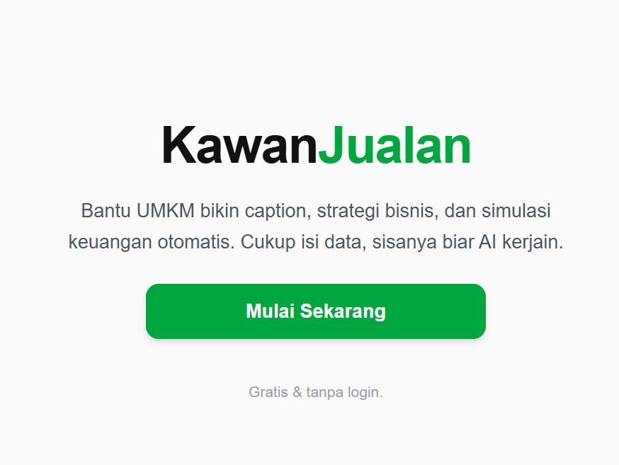
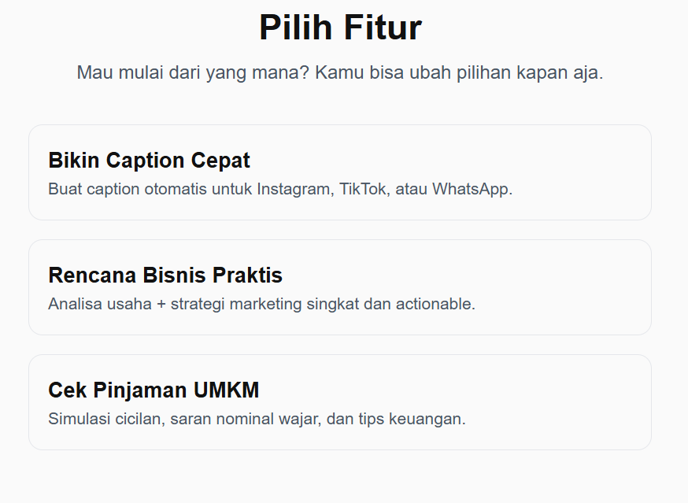
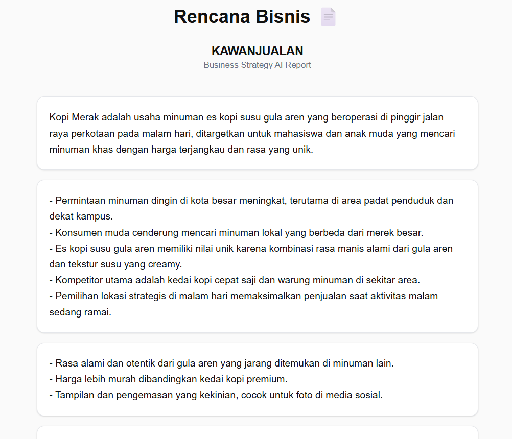

# KawanJualan

## Home

AI-assisted content & strategy generator untuk UMKM.  
Tujuan aplikasi ini adalah membantu pemilik usaha kecil menghasilkan:

- Caption Marketing
- Business Strategy
- Financial Simulation
- Export hasil dalam format DOCX
- No login, no database – semua data disimpan di perangkat pengguna.

Aplikasi ini dibuat dengan fokus pada **real impact untuk UMKM**, bukan sekadar tools AI biasa.

---

## Why KawanJualan?

UMKM sering kali tidak punya waktu atau skill marketing. KawanJualan membantu:

| Tantangan UMKM | Solusi Aplikasi |
|---|---|
| Sulit bikin caption promosi | AI generate 3 style caption otomatis |
| Tidak tahu strategi bisnis | Rencana bisnis otomatis berdasarkan input |
| Tidak paham simulasi keuangan | AI hitung simulasi cicilan, risiko, dan tips finansial |
| Tidak mau ribet | Data tersimpan lokal, tidak perlu login |

---

## 🧠 Fitur Utama

- AI Caption Generator (3 format: pendek, medium, storytelling)
- AI Business Planner
- AI Finance Simulation
- Export hasil ke `.docx`
- Regenerate result
- Copy all content (1 klik)
- LocalStorage session resume

---

## Tech Stack

| Layer | Stack |
|---|---|
| Framework | Next.js 16 (App Router) |
| Styling | Tailwind v4 |
| AI | Qwen 3B via KolosalAI |
| Export | DOCX (docx.js) |
| Storage | LocalStorage (client-only) |
| Deployment | Vercel |

---

## Result nya

## Instalasi + Pemakaian

Lihat [GUIDE.md](./GUIDE.md) — Untuk Langkah Instalasi Sampai Pemakaian.

---

## Live Demo
https://kawan-jualan.vercel.app

---

## 🎥 Video Demo

> Link Video: [_Video Demo_](https://drive.google.com/file/d/1zLYgXJAI7wiSWo2N9c8-UiGkXIXAwaF6/view?usp=drive_link)

---

## 👥 Kontributor

- Frontend + Logic:  Wicayonima and NPL
- Prompt Engineering: Custom in-house
- UI/UX: Minimalist Clean Approach (User-first)

---

## 📄 Lisensi

 — bebas digunakan untuk manfaat UMKM.

